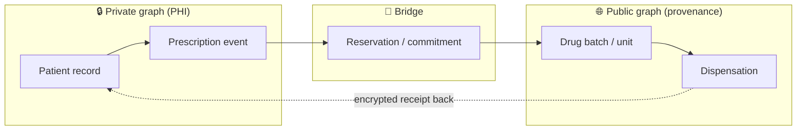
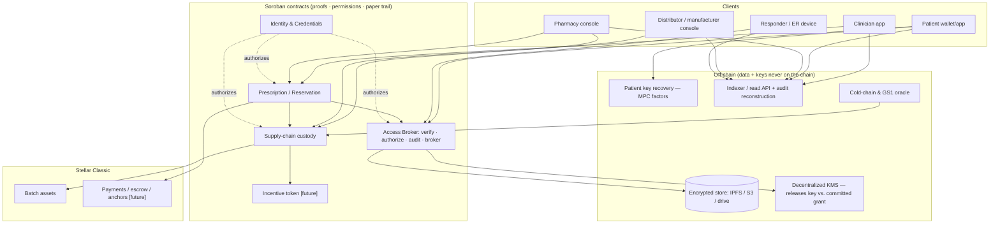
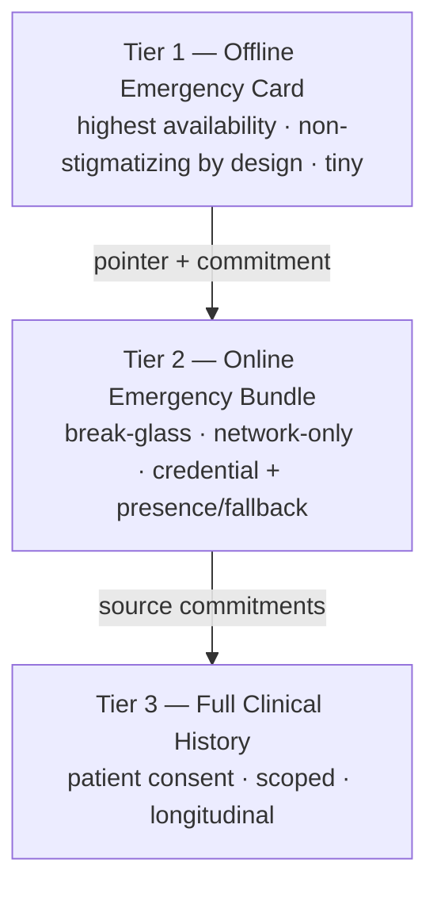
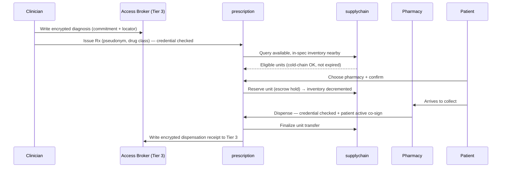

# Integrated Health Records + Drug Supply Chain on Stellar — MVP Requirements

**A single system where a clinician moves seamlessly from diagnosis to dispensed medication, built on a decentralized access-broker that verifies, audits, and brokers access to off-chain clinical data — while the data itself, split into real privacy tiers, never touches the chain.**

> **Document scope.** This is a requirements-level synthesis for starting an MVP — *what the system must do and why*, not how it is coded. It consolidates the architecture, the privacy/tier model, and two rounds of adversarial review into one place.
>
> **Guiding MVP principle (recurring below):** *stub the decentralization, never stub the predicate.* The MVP may centralize things that are operationally hard (the key-management network, credential issuance, the admin key). It must **not** weaken the rules that gate access — the authorization predicate, the consent veto, and revocation are real from day one, because the system's safety depends on them.

---

## 1. The integration thesis

The prior-art survey shows a clean split: projects do *either* patient-controlled health records (Healthy-Stellar, VitaCare, Teye-Contracts) *or* drug provenance (Product Authenticator dApp, the ScaffoldRust vaccine ledger). None close the loop between them, because the two domains pull in opposite directions:

- **Health records demand privacy.** PHI must stay off-chain, encrypted, pseudonymous, and access-gated by the patient.
- **Supply chains demand transparency.** Batch provenance, custody, and cold-chain logs are most valuable when openly verifiable.

The design problem is to find the *one object* that legitimately belongs to both worlds and engineer a clean, leak-proof seam there. **That object is the prescription** — at the same instant a *clinical event* (belongs in the private record) and a *demand signal* (should reserve a real drug unit). It is the only place the private and public graphs touch.



Two further organizing ideas carry the rest of the design:

- **The access broker.** The system never moves the clinical record on-chain. A contract acts as a decentralized **access broker** that (1) verifies the data is authentic against an on-chain commitment, (2) verifies the requester's credential and consent grant, (3) audits every access, and (4) brokers access by releasing a *pointer* to the encrypted data. The chain holds proofs, permissions, and the paper trail — never PHI.
- **The key-release layer.** The broker's pointer leads to *ciphertext*. A separate decentralized **key-management layer (KMS)** releases the decryption key only against committed, unrevoked, un-vetoed, in-window grant state. Authorization (broker) and keying material (KMS) are deliberately separated so no single layer can leak data alone.

---

## 2. How this differs from the prior art

| Capability | Healthy-Stellar / VitaCare | Product Authenticator / ScaffoldRust | **This system** |
| :--- | :---: | :---: | :---: |
| Patient-controlled records (off-chain + on-chain commitment) | ✅ | — | ✅ |
| Drug provenance / anti-counterfeit | — | ✅ | ✅ |
| Cold-chain logging | partial | partial | ✅ |
| **Tiered access (offline card / break-glass / full)** | — | — | ✅ |
| **Emergency break-glass with consent veto window** | — | — | ✅ |
| **Prescription reserves real inventory** | — | — | ✅ |
| **Dispensation writes back to the record** | — | — | ✅ |
| **Decentralized key release tied to on-chain consent** | — | — | ✅ |
| **Single clinician workflow, diagnosis → dispense** | — | — | ✅ |

The differentiator is the **closed loop** (diagnosis → prescription → reservation → dispensation → record update) *plus* a **real, tiered privacy model** that handles cases the prior art ignores: the unconscious patient, the offline paramedic, the responder who needs three facts rather than a whole life history.

---

## 3. Why Stellar / Soroban

Argued, not assumed, because the prior art lives mostly on Ethereum, Fabric, and Hedera.

- **Two complementary layers.** Stellar Classic gives native asset issuance (every drug batch is an issued asset), cheap high-volume payments, escrow, and fiat on/off ramps via anchors (for copays/settlement, `[future]`). Soroban gives the contract logic — access control, the prescription state machine, custody rules.
- **Cost and latency fit the workload.** Supply-chain events are high-frequency and individually low-value; sub-cent fees and fast finality make per-unit tracking economically sane.
- **Native asset model maps to drug units** — provenance, partial transfers, and balance auditing nearly for free.
- **The ledger is decentralized day one.** The settlement and audit substrate is decentralized even while the application layer (our contracts, issuer set, KMS) starts centralized and decentralizes over time.

**Honest trade-offs:** Soroban's ecosystem is younger than the EVM's; storage rent/TTL adds engineering overhead; on-chain confidential compute is thin (which is *why* PHI stays off-chain). **There is no first-party, audited Stellar key-management service** — decentralized key release is an external dependency (see §5.6).

---

## 4. System architecture



**Confirmed access model (requirements).** A read involves two wallet identities (the requester and the patient owner), a scoped access request, the patient's signature of consent, and the broker opening a gate by returning a locator + metadata. The bytes then move over HTTPS between the requester and the storage location. The single most important requirement: **what the requester fetches is ciphertext**; the decryption key is released *separately* by the KMS, only against committed on-chain consent. Authorization and key release are two distinct gates.

**What goes on-chain:** never PHI. Only content commitments / locators, pseudonymous identifiers, consent grants (with scope, reveal-time, expiry, revoked/vetoed status), supply-chain provenance, and prescription state. Audit is emitted as events and reconstructed off-chain, so the trail grows without accruing on-chain storage rent.

---

## 5. Core modules

### 5.1 Identity & Credentials (`identity`)
The trust root. Holds verifiable credentials per role (patient, clinician, pharmacy, distributor, manufacturer, regulator/responder). Issuing or dispensing requires the matching valid, unrevoked credential. **The primary security control of the whole system lives here: identity assurance at onboarding.** Issuers must verify institutional *and* individual identity before any credential enters a smart-contract relationship; the network trusts a responder because the verified, revocable institution vouched for them. Patient real-world identity is bound off-chain; on-chain the patient is a **stable** pseudonymous key.

### 5.2 Access Broker — Records & Consent (`broker`)
Patient-controlled. Stores, per record, a commitment + locator + scope tags — never content. Implements granular, time-bound, purpose-scoped consent and emits every read/grant/revocation as an audit event. Requirements:

- **Stable record identity.** A patient's clinical history is anchored to one stable identity and indexed by an off-chain manifest, so a clinician with a valid grant always sees a coherent longitudinal record. (Any one-time/unlinkable identifiers are a *public-graph* privacy measure only — see §8 — and never fragment the clinical record itself.)
- **Authorization, not key custody.** The broker decides *who may decrypt what, until when*, and returns a non-secret pointer. It never holds or returns secret keys.
- **Consent veto window.** Emergency authorizations carry a short reveal delay during which a conscious patient can cancel (see §6.1).
- **Revocation.** Cuts *future* access (the KMS re-checks current state every release); it cannot un-leak already-retrieved data, and the UI must say so.

### 5.3 Prescription / Reservation (`prescription`) — the bridge
State machine `ISSUED → RESERVED → DISPENSED → CLOSED` (with `EXPIRED/CANCELLED`). Requirements:

- **Issue** references a pseudonymous patient ID and a drug class — never the diagnosis or patient name (those stay encrypted in the record).
- **Reserve** places an escrow hold on a concrete unit at the patient's chosen pharmacy, decrementing available inventory.
- **Dispense** finalizes the unit transfer and writes an encrypted dispensation receipt back to the patient's record. **Dispensation requires the patient's active co-signature** (the patient is present and signs on their own device) — this both confirms receipt and prevents dispensing to fictitious patients.
- **Privacy seam:** the public supply chain sees only "unit N reserved/dispensed against prescription #abc"; drug identity is a public supply-chain fact, patient identity and clinical reason are not.

### 5.4 Supply-chain custody (`supplychain`)
Each batch is an issued asset; units are serialized to the regulatory granularity (DSCSA/EU FMD). Custody hops are asset transfers + events. A cold-chain oracle posts excursions; an out-of-range batch is quarantined so reservation refuses it. GS1 (GTIN/GLN/SSCC) maps physical identifiers to on-chain ones. **Trust requirement (revised after review):** provenance must not rest on custody-party co-signatures alone (they share an interest in "looking green") — it must include an opposing-interest attester and hardware the custody parties don't control (see §8 and §16).

### 5.5 Incentive token (`incentive`) `[future]`
A closed-loop, non-speculative utility mechanism rewarding inventory-accuracy and clean cold-chain records, slashing phantom inventory. Clinicians are kept entirely outside the reward surface so drug choice is never financially nudged. Deferred past MVP.

### 5.6 Decentralized key management & recovery (`kms`)
The key-release layer that complements the broker. Requirements:

- **Release predicate.** The KMS releases a record's decryption key to a requester **only if** a committed broker grant satisfies: `requester matches ∧ not revoked ∧ not vetoed ∧ reveal-time passed ∧ not expired`. It re-evaluates this against *current committed* on-chain state on every request (a release is never a reusable ticket).
- **No release from uncommitted/simulated state.** A request that was only previewed, not committed on-chain, releases nothing.
- **MVP vs. future.** Because Stellar ships no first-party KMS, the MVP may run a single key-release service (a documented single trust point, like the admin key) **but the predicate above is fully real.** The planned decentralization target is a threshold network (Lit Protocol), where the key is split across independent nodes and released only when a quorum agrees the on-chain predicate holds. The bridge that reads committed Stellar state into that network is a known future trust seam requiring independent reads by multiple nodes (see §14, §16).
- **Patient key recovery.** Patient keys are recoverable via MPC factors (device + social + backup, e.g. Web3Auth-style), so a lost phone, dead bracelet, or forgotten key never means a lost medical history. This also underpins the "bricked token" fallback (§6.1).

---

## 6. Clinical history access tiers

Clinical history is split by urgency, sensitivity, and access conditions into three tiers. **The tier boundary is real in design, not a UI filter over one record** — each tier is a distinct object with its own commitment, verification rule, and storage treatment.



| | **Tier 1 — Offline Card** | **Tier 2 — Break-Glass Bundle** | **Tier 3 — Full History** |
| :-- | :-- | :-- | :-- |
| **For** | Paramedic, no network, patient unconscious | Credentialed responder, network up, patient can't consent | Normal patient-granted care continuity |
| **Read via** | NFC / QR / wallet pass / bracelet (offline) | **Network only** — pointer + emergency attestation | Patient-issued scoped consent grant |
| **Authorization** | Signed card / pointer | Valid credential + presence proof (or tokenless fallback) + reveal window | Valid credential + in-scope consent grant |
| **Audit** | Deferred (logged on device, posted on reconnect) | Immediate event; patient notified | Immediate event |
| **Sensitivity** | **Non-stigmatizing by design** (leak is survivable) | Limited, emergency-relevant only | Full; sensitive categories need extra confirmation |
| **Contents** | Severe allergies, critical meds, major conditions, implants, directive flag, emergency contacts, pointer to Tier 2 | Tier 1 + dosages, recent encounters/procedures, key labs, emergency-flagged notes | Full longitudinal record incl. prescriptions & dispensation receipts |

Tier 3 is where the prescription bridge writes dispensation receipts. Tier 2 deliberately excludes supply-chain/reservation history unless directly medication-safety-relevant, firewalling the public graph from emergency reads.

### 6.1 The consent veto window (emergency reads)
A short reveal delay sits between an emergency authorization and the key release:

- **Conscious patient** is notified within the window and can **veto** the read (e.g. a covert relay attempt in a waiting room). A veto is guaranteed to win the race — once vetoed, the read can never release.
- **Unconscious patient** issues no veto; the read proceeds after the window. The cost is a bounded delay — far better than today's reality of *no records at all*.
- **Criticality-graduated.** The most time-critical, least-stigmatizing micro-subset (severe allergies, anticoagulants, implants) releases **instantly** (zero window); the fuller payload and the Tier-2 pointer carry the window. A clinician never waits to learn the patient is on an anticoagulant.
- **Bricked-token / opt-out fallback.** Proof-of-presence is *preferred-when-available, never a precondition*. If the patient has no token, lost it, or the tap fails, emergency access falls through to a **tokenless fallback**: institution + second-clinician dual co-sign, vital-subset only, heavily audited. Care is degraded but never denied.

---

## 7. End-to-end workflows

### 7.1 Doctor → dispense (the core loop)



The clinician never leaves their app; the patient sees a fulfilled prescription; a regulator can audit provenance without seeing PHI.

### 7.2 Emergency break-glass (the privacy stress test)

```mermaid
sequenceDiagram
    participant E as Responder / ER
    participant Card as Tier 1 card
    participant B as Access Broker
    participant K as KMS
    participant Pt as Patient

    alt Network down
        E->>Card: Read offline card (signed, non-stigmatizing)
        E->>E: Verify signature; act; queue deferred audit
    else Network up (Tier 2)
        E->>B: Break-glass request (credential + presence proof OR fallback)
        B->>B: Emit audit; open grant with reveal window
        Pt-->>B: (Conscious) may VETO within window
        Note over B,K: After window, if not vetoed/revoked/expired
        K-->>E: Release decryption key (committed-state check)
        E->>E: Fetch ciphertext, decrypt, verify commitment
        B-->>Pt: Notify
    end
```

---

## 8. Privacy, security & compliance (requirements)

- **No PHI on-chain, ever.** Only commitments, pseudonyms, consent state, and provenance. GDPR erasure is satisfiable because PHI lives off-chain and is destroyable; only non-identifying commitments persist (confirm with counsel).
- **Authenticity is verifiable.** Every read ends by checking the retrieved data against its on-chain commitment, so tampered/stale data is detectable, not trusted blindly.
- **Authorization ≠ key custody.** The broker authorizes and points; the KMS releases keys against committed consent and re-checks on every request (non-bearer). Revocation and veto therefore actually cut future access.
- **Proof of presence, used proportionately.** Binds privileged actions to the physically-present patient. **Dispensation (patient conscious) requires an active patient co-sign** and is relay-resistant. **Emergency reads (patient unconscious)** use a passive token tap; the residual relay risk is bounded (one nearby patient, audited, non-stigmatizing data, mitigated further by the veto window) and accepted.
- **Tiered offline tradeoff, stated openly.** Offline access cannot produce on-chain audit at read time — an accepted availability-over-auditability choice, bounded by: Tier 2 is never offline; Tier 1 is non-stigmatizing by design; offline reads consume a finite, signed budget that forces resync; the patient's card surfaces evidence of reads independently.
- **Metadata posture (public-place equivalent).** The clinical record stays under a stable identity (longitudinal continuity). The *public* supply-chain footprint may use one-time/unlinkable identifiers and class-level commitments to avoid a behavioral map; residual timing/location correlation is accepted as roughly equivalent to being observed at a physical pharmacy. Strong anonymity is not promised at low MVP volume.
- **Cold-chain trust needs opposing interests.** Custody co-signatures alone are insufficient; provenance must include a downstream/independent attester whose interests oppose "looking green" (liability-bearing pharmacy, patient/clinician, insurer/regulator) plus hardware the custody parties don't control. The chain's role is to make false claims attributable.
- **Key recovery.** MPC-factor recovery (device + social + backup) so a lost key is recoverable.
- **Audits.** Independent audit of broker, prescription, and supply-chain logic, and of the KMS release predicate, before any pilot.

---

## 9. Storage, state & rent strategy (requirements)

- **On-chain state is a function of *active* grants/prescriptions, not total history.** Bulk history archives off-chain and is restorable on demand; the audit trail lives in events, not rent-bearing state.
- **The emergency-critical path must never fail for a storage-rent reason.** Critical commitments are kept always-alive (e.g. a single Merkle-rooted entry) under sponsored auto-renewal. An emergency read that fails because a grant entry's rent lapsed is treated as a **correctness defect**, not mere hygiene.
- **Users transact gaslessly.** Patients, clinicians, and responders never need to hold tokens or manage rent; the operator (MVP) absorbs fees and renewals, with a fee model deferred (`[future]`).

---

## 10. Network governance & trust model

The ledger is decentralized day one; the application layer starts centralized and decentralizes over time — stated plainly rather than overclaimed.

**MVP (now):** single operator/admin key; a small, hand-verified credential issuer set; a single key-release service (predicate real, decentralization deferred); contracts upgradeable under the admin key.

**Proposed `[future]`:** federated credential issuance by recognized authorities; admin key behind timelock + multisig, then stakeholder governance; threshold KMS (Lit) replacing the single key service; distributed, self-sovereign keys with recovery; scoped, audited regulator access to archived state for disputes — never standing access to live PHI.

Every centralized MVP choice has a named successor; the migration path matters more than the starting point.

---

## 11. Business model `[future]`

Out of MVP scope, stated so the design doesn't foreclose it. **The patient never pays, and clinical choices are never monetized.** Candidate surfaces: SaaS to institutions; a small per-dispensation fee on the supply side; payer/insurer subsidy; anchor/settlement fees. The incentive token is behavioral, non-speculative, and walled off from clinicians.

---

## 12. Tech stack & external dependencies

- **Contracts:** Soroban; batch assets on Stellar Classic; escrow for reservations.
- **Off-chain storage:** storage-agnostic locator (IPFS/Filecoin, S3, institutional reference, removable media); envelope encryption with per-record keys.
- **Identity:** verifiable credentials + DIDs anchored via the `identity` contract.
- **Key management (external):** decentralized threshold KMS — **Lit Protocol** is the planned target (MVP stubs a single service); **Web3Auth-style MPC** for patient key recovery. Note: these read on-chain state from EVM/Cosmos/Solana natively, so a **Stellar-state bridge** (independent reads of committed Stellar state) is required and is a tracked integration risk.
- **Standards:** GS1 (GTIN/GLN/SSCC) for product ID; FHIR as the off-chain clinical record format for EHR interoperability.
- **Oracle:** signed cold-chain feed into `supplychain`.
- **Indexer:** off-chain service reconstructing the audit trail from events and serving fast reads.
- **Apps:** clinician, patient wallet, pharmacy/distributor consoles, lightweight responder reader.

---

## 13. MVP scope & phased roadmap

Solo build, ordered by capability (no team/timeline estimates by design). Tier order follows the access-tiers note: **Tier 3 first, then Tier 2, then Tier 1.** The recurring rule applies throughout: *stub the decentralization, never stub the predicate.*

| Phase | Capability | Done when |
| :--- | :--- | :--- |
| **0 — Spec & threat model** | Fix data-flow, tier boundaries, GS1/FHIR mapping; legal review of on-chain commitments; pin the access predicate | Architecture signed off; counsel green-light |
| **1 — Broker + Tier 3 + KMS gate** | Match best prior art; consent, audit, commitment verification; key released only against committed grant (single-service KMS, real predicate) | Patient can store, grant, revoke, audit; requester verifies authenticity; revocation cuts future access |
| **2 — Tier 2 break-glass + veto window** | Network-only emergency access; presence proof + tokenless fallback; reveal window with conscious-patient veto; deferred-audit + notification | Credentialed responder opens a time-boxed bundle; conscious patient can veto; unconscious read proceeds after window |
| **3 — Tier 1 offline card** | Offline, non-stigmatizing emergency read; finite signed budget; deferred audit | Card reads with no network; audit posts on reconnect; budget caps blast radius |
| **4 — Supply-chain + cold chain** | Provenance + opposing-interest attestation + excursion quarantine | Verifiable batch journey; damaged batch refused at reservation |
| **5 — The bridge** | Close the loop *(core differentiator)*; reservation escrow; dispense with patient active co-sign; receipt write-back | Live diagnosis → reserve → dispense → record demo; no ghost dispense |
| **6 — Patient key recovery** | MPC-factor recovery; bricked-token fallback validated | Lost-key recovery works; fallback path exercised |
| **7 — Decentralize the KMS** `[future]` | Lit threshold network + Stellar-state bridge (independent reads) replacing the single service | Same predicate, decentralized release; bridge hardened |
| **8 — Incentives, payments, governance, pilot** `[future]` | Incentive token; anchors/settlement; federated issuance + multisig; clinic + pharmacy + distributor pilot | Regulatory sign-off; external audit passed; mainnet |

---

## 14. Risks & open questions

- **Regulatory:** prescription law, e-prescribing, serialization (DSCSA/EU FMD) are jurisdiction-specific; conform per market. *Resolve in Phase 0.*
- **App-layer centralization (MVP):** single admin key and single KMS service gate access; mitigation is the §10 migration path, named openly.
- **The Stellar-state bridge to the KMS is the next sharpest seam** (`[future]`): if enough key-release nodes can be fed a forged or stale view of Stellar state, the predicate passes on false premises. Requires independent reads by multiple nodes that must agree, plus committed-only reads. Interacts with §9 (an archived grant entry reads as absent → deny → a legitimate emergency read can fail for a rent reason).
- **Cold-chain collusion:** the strongest review finding — co-signatures need genuinely opposing interests; the design now requires a downstream/independent attester and hardware the custody parties don't control. Residual fraud is made attributable, not impossible.
- **Relay attacks on presence:** bounded and audited; the dispensation path is relay-resistant via active co-sign, the emergency path accepts a bounded residual.
- **Offline auditability:** intrinsically deferred; bounded by non-stigmatizing, budget-capped Tier 1 — an accepted tradeoff.
- **Adoption / chicken-and-egg** and **incentive integrity** `[future]`: the loop pays off only with multi-party participation; the token must never bias clinical choice.

---

## 15. Success metrics

- **Loop completion rate** — issued prescriptions reaching a recorded dispensation through the system.
- **Authenticity** — share of reads where the requester verified data against the on-chain commitment (target 100%).
- **Consent integrity** — vetoed reads never release; revoked grants never release after revocation; no release from uncommitted state.
- **Break-glass correctness** — time-boxed grants expire on schedule; every online emergency read has an audit event and patient notification.
- **Availability of care** — emergency read never *denied*; bounded delay only (and zero delay for the critical micro-subset).
- **Inventory & cold-chain** `[future]` — on-chain vs physical variance; share of dispensed units with unbroken in-spec logs.
- **Privacy** — zero PHI on-chain (audited); public-graph exposure no worse than the stated public-place baseline.
- **State discipline** — live on-chain state stays a function of active grants/prescriptions.
- **Clinician friction** — clicks/seconds from diagnosis to confirmed reservation.

---

## 16. Threat model & hardening decisions

Synthesis of two adversarial review rounds and their resolutions, at requirements level.

### 16.1 Unifying primitives
- **Proof of patient presence** — privileged actions bind to the physically-present patient via the patient's token, so an action can only target the patient in front of you. *Preferred when available, never a precondition.* **Active co-sign on dispensation** (relay-resistant); **passive tap on emergency reads** (bounded residual).
- **Consent veto window** — a short reveal delay lets a conscious patient cancel an emergency read; unconscious patients proceed after the window; the most-critical subset is instant (§6.1).
- **Authorization vs. key release** — the broker authorizes and points; the KMS releases keys only against committed, unrevoked, un-vetoed, in-window consent, re-checked every time. Uncommitted/previewed requests release nothing.
- **Trust anchored at onboarding** — the primary control is issuer verification of institutional + individual identity, not friction on the legitimate emergency read.

### 16.2 Attack → decision

| Concern | Decision |
| :-- | :-- |
| **Metadata behavioral map** | Stable identity for the clinical record (longitudinal view preserved); unlinkability is a *public-graph-only* measure; residual leak accepted as public-place-equivalent |
| **Record fragmentation / siloed care** | Not a real risk — the record is read from a stable manifest, never reconstructed from public-ledger crawling |
| **NFC relay** | Active co-sign on dispense (relay-resistant); emergency residual bounded + audited + veto-window-mitigated |
| **Cold-chain spoofing & co-sign collusion** | Require an opposing-interest attester + uncontrolled hardware + independent audits/slashing; chain makes false claims attributable |
| **Offline (Tier-1) "ghost" audit** | Accept deferred audit; bound via non-stigmatizing Tier 1, network-only Tier 2, finite signed offline budget, patient-side detection |
| **Storage-rent "denial of history"** | Critical state always-alive (Merkle-rooted, sponsored); an emergency read failing for rent is a correctness defect |
| **Simulation scrape / bearer capability / revocation bypass** | Broker returns non-secret pointer; KMS releases only against committed state and re-checks every time |
| **Break-glass on a stolen credential** | Onboarding assurance + presence binding + institutional co-sign + rate-limit + patient-defined emergency scope |
| **Bricked / absent token (availability)** | Tokenless dual-co-sign fallback (vital subset, heavy audit); presence never a precondition; MPC key recovery |
| **Bridge race / pharmacy-key compromise** | Reservation escrow auto-reverts (no permanent lock); atomic dispense; patient active co-sign blocks ghost dispense; pharmacy multisig + rate-limit + reconciliation freeze |
| **KMS re-centralization** | MVP single service with a real predicate; planned threshold network (Lit); bridge to committed Stellar state hardened via independent multi-node reads |

### 16.3 The risk calculus
The dominant real-world harm is clinicians flying blind in emergencies — systemic and recurring. Credential-theft data loss is rarer, bounded, attributable, and revocable. Optimize for the common life-saving case; make the rare attack expensive and traceable. Do not over-harden the legitimate emergency read.

---

### One-line summary
Build **one prescription primitive** that is private on the patient's side and transparent on the drug's side; serve it with **one access-broker** that authorizes, audits, and points — never holds the data — and **one key-release layer** that hands over the key only against committed, un-vetoed, unrevoked consent; split the clinical data into **real tiers** that never touch the chain; and anchor trust at **who you let in**, not at friction on the doctor trying to save a life.
