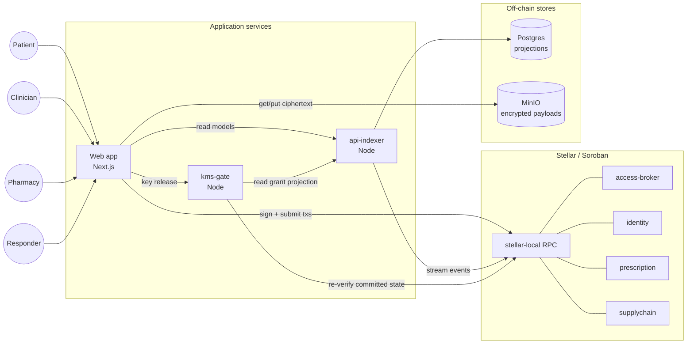
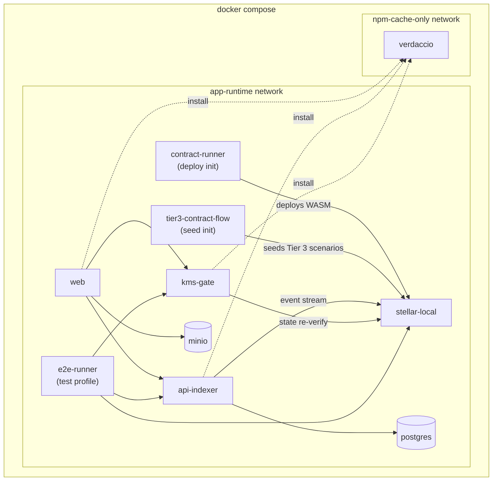
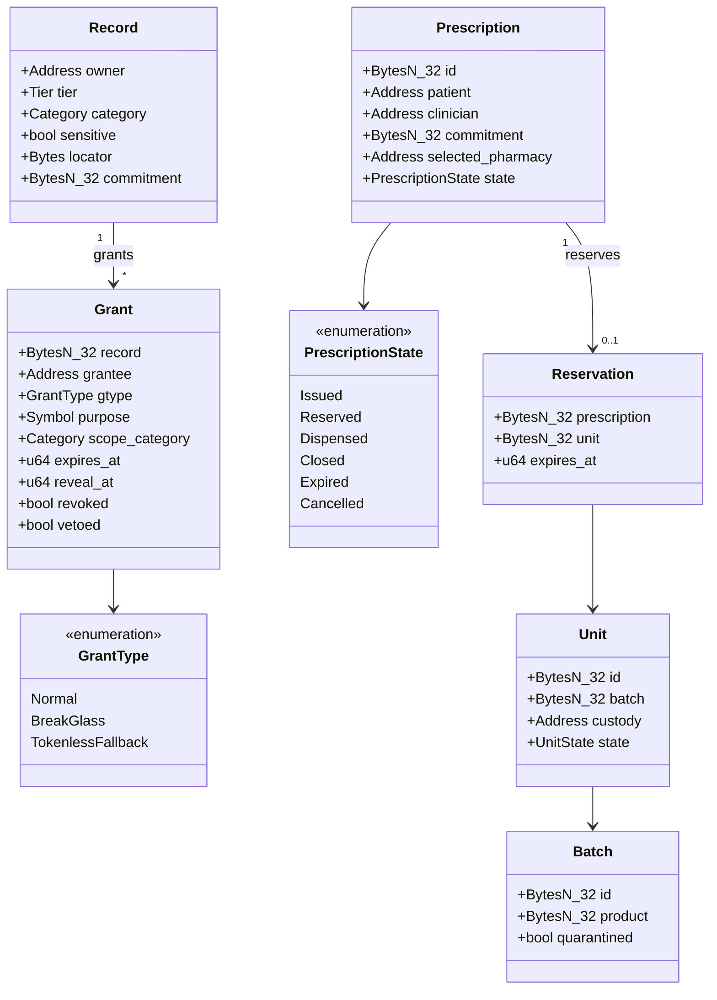
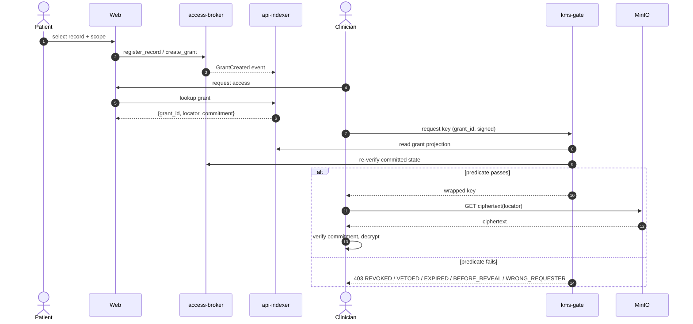
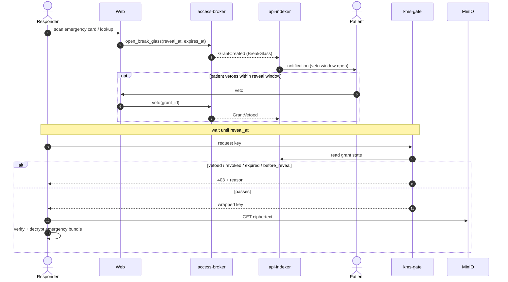
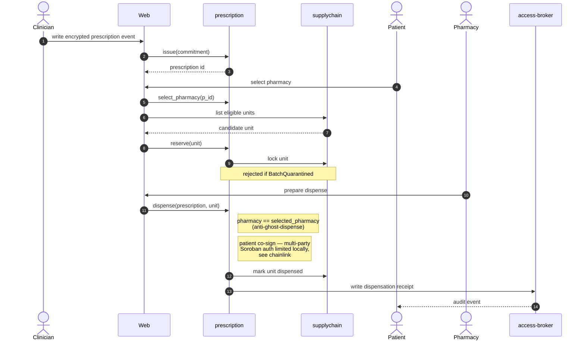
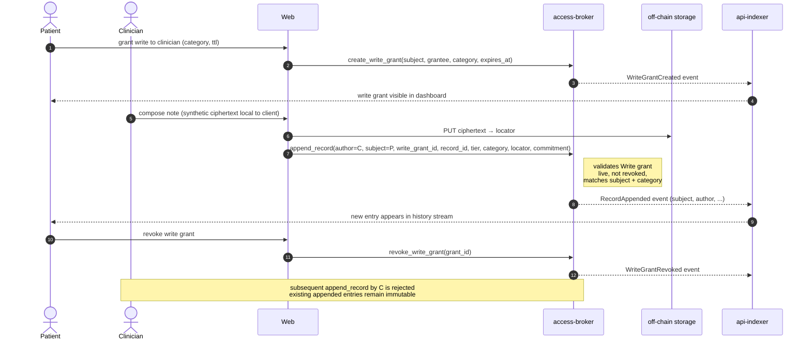

# Software Architecture

## Status

Proposed baseline, updated from the Claude planning notes in `docs/claude/`. This document should be reviewed before implementation scaffolding. It defines the target system boundaries, module scaffolds, and safety properties that should exist before functional implementation deepens.

The guiding MVP rule is: **stub the decentralization, never stub the predicate**. The MVP may centralize operationally hard pieces such as KMS, admin control, and credential issuance. It must not weaken the access predicate, revocation, veto, audit, or requester-binding rules that protect clinical data.

## Architecture Goals

The MVP must prove one closed loop:

1. Patient grants access to clinical history.
2. Clinician reads/translates/reviews the record.
3. Clinician writes a diagnosis or update.
4. Clinician issues a prescription.
5. Prescription reserves eligible inventory from a participating pharmacy or hospital.
6. Pharmacy dispenses with patient active co-signature.
7. Dispensation writes back to the patient record.

The system should keep protected clinical content off-chain. Stellar/Soroban coordinates identity, consent, auditability, integrity commitments, prescription state, inventory reservation, and supply-chain provenance. Encrypted clinical payloads live behind storage-agnostic record locators.

The prescription remains the bridge object: a private clinical event on the patient side and a public demand/reservation signal on the supply-chain side.

## Current Prototype Notes

The current repository has:

- a Next.js frontend under `components/web/src/`
- ElenaJS (`@elenajs/core`) installed as a runtime dependency and used for a progressive custom workflow-status element on the homepage
- a placeholder contract client in `components/web/src/lib/contract.ts`
- a basic wallet state hook using local storage
- a Soroban contract under `components/contracts/medical-record`

ElenaJS is approved through the Verdaccio package flow and is now part of the web runtime. Keep it scoped to component boundaries where progressive web components help portability or cross-framework reuse; plain React remains appropriate for app-specific screens.

The current prototype stores or displays human-readable clinical notes through the record model. That is useful for demonstration, but it does not match the target architecture. In the target architecture, notes and other PHI move to encrypted off-chain payloads. Contracts keep commitments, locators, grant metadata, veto/revocation state, and audit events only.

The current `medical-record` contract should be replaced by an access broker contract. It should not remain a place where readable clinical notes are appended on-chain.

## System Overview

The diagrams below summarize how the runtime pieces connect. They are
non-normative — the prose sections that follow remain the source of
truth for component responsibilities.

### Component map

Logical view of services, contracts, off-chain stores, and the actors that
drive flows through the web app.



Key invariants visible in the diagram:

- The web app never asks contracts for decryption keys. Key release is a
  separate request to `kms-gate`.
- `kms-gate` re-reads committed Stellar state on every release. The
  api-indexer projection is a hint, not a trust anchor.
- Ciphertext lives in MinIO. The chain stores only locators and
  commitments.

### Deployment view

Docker Compose layout for local development and e2e
(`e2e/docker-compose.yml`).



Init-only services (`contract-runner`, `tier3-contract-flow`) run once
and exit; downstream services wait on `service_completed_successfully`.

## System Components

### Web App

Next.js application for patient, clinician, pharmacy, and responder workflows.

Responsibilities:

- patient dashboard
- normal record access grants
- emergency profile and offline-card management
- clinician record review
- clinician record update
- prescription issue flow
- pharmacy inventory reservation and dispense flow
- responder emergency access flow
- patient veto and notification flow
- audit trail views

The web app should depend on domain services and typed clients, not call contracts or storage providers directly from UI components.

### API, Indexer, and Workflow Service

Node/TypeScript service that provides read models and workflow APIs.

Responsibilities:

- index Soroban contract events
- maintain queryable projections in Postgres
- normalize grants, emergency access, prescription state, inventory state, and audit events
- expose demo fixture and seed APIs for local development
- mediate workflows that need server-side orchestration
- submit delayed offline audit events when responder devices reconnect
- notify patients of emergency access and veto opportunities

For the MVP, this can be one service. It can split later into `api`, `indexer`, `worker`, and `notification` services if the codebase needs it.

### Access Broker Contract

Soroban contract that replaces the earlier `records`/`emergency` split.

Responsibilities:

- store record metadata: owner pseudonym, tier, category, sensitivity flag, locator, commitment
- create normal grants for Tier 3
- create break-glass grants for Tier 2
- track `revealAt`, `expiresAt`, `revoked`, and `vetoed`
- verify credential references and requester binding
- enforce scope/category rules
- emit access, revoke, veto, fallback, and delayed-audit events
- return only non-secret capability data: grant id, locator, and commitment

The broker is a policy and audit layer, not a key vault. It must never return decryption keys, wrapped keys, or PHI.

The contract return value must be safe to publish. Soroban clients preflight calls by simulation, and simulation can expose return values without committing state or emitting a durable audit event. Any value that would be unsafe in a simulation response does not belong in a contract return value.

### KMS Gate

Key-release layer separate from the broker.

Responsibilities:

- release or re-wrap data keys only when committed broker state satisfies the release predicate
- re-read current committed Stellar state on every key request
- reject simulation-only grants
- reject revoked, vetoed, expired, wrong-requester, or unrevealed grants
- provide a local MVP implementation that can later be replaced by Lit Protocol or another threshold KMS

The release predicate:

```text
committed grant exists
AND grant.requester == caller
AND NOT grant.revoked
AND NOT grant.vetoed
AND grant.revealAt <= now
AND now < grant.expiresAt
```

The MVP can run a single `LocalStubGate`, but the predicate is real from day one. Future decentralization target: a threshold KMS such as Lit Protocol, with a Stellar-state bridge that reads committed ledger state from independent RPC views.

### Storage Layer

Storage-agnostic encrypted payload layer.

Responsibilities:

- store encrypted clinical record payloads
- store encrypted emergency bundles
- expose record locators
- produce content commitments for verification
- support provider-specific retrieval without changing consent logic

Initial local backend recommendation:

- MinIO/S3-compatible storage for deterministic Docker development

Supported abstraction targets:

- S3-compatible object storage
- IPFS
- Filecoin-backed IPFS
- physical encrypted drive
- user-controlled filesystem
- institutional document reference

### Crypto Layer

Application-level encryption, commitment, key wrapping, and signatures.

Responsibilities:

- encrypt clinical payloads before storage
- wrap data keys for KMS-managed release
- verify payload commitments against on-chain metadata
- support emergency bundle keys distinct from full-record keys
- sign and verify offline emergency-card payloads
- sign and verify delayed offline audit submissions
- support patient presence proofs for emergency access

Production-grade key management is a later hardening phase, but the interfaces and predicates must be real in the MVP.

### Identity and Credential Layer

Trust root for actors.

Responsibilities:

- register credential issuers
- issue/revoke credential references
- verify role and subject binding
- support patients, clinicians, institutions, pharmacies, distributors, manufacturers, responders, and auditors

The primary security control is onboarding assurance. The system trusts a responder or clinician because a verified, revocable institution vouched for them.

### Prescription Contract

Soroban contract coordinating the bridge between private clinical event and public inventory demand.

Responsibilities:

- issue prescription commitment
- reserve eligible inventory unit
- expire/cancel reservation
- mark dispensed
- require pharmacy credential
- require patient active co-signature for dispensation
- write encrypted dispensation receipt commitment back through the access broker

Dispensation co-signature is a core anti-fraud rule. It prevents ghost dispensing to fictitious or absent patients.

The public reservation footprint should not become a patient medication-history graph. The MVP should at least use fresh unlinkable reservation identifiers per prescription. A hardened path can add class-level commitments or zero-knowledge reservation proofs so the supply chain can verify a legitimate matching prescription without publishing a stable patient-drug edge.

### Supply-Chain Contract

Soroban contract for inventory, custody, availability, quarantine, and dispense state.

Responsibilities:

- register drug products, batches, and serialized units
- transfer custody
- update availability
- reserve units
- quarantine expired or compromised batches
- mark units dispensed
- consume cold-chain oracle events
- record opposing-interest attestation where applicable

Custody-party co-signatures are not enough. Provenance should include an opposing-interest attester, such as a liability-bearing pharmacy, patient/clinician, insurer, regulator, or audited hardware source the custody parties do not control.

The blockchain does not prove physical truth by itself. Its job is to make custody, sensor, and attestation claims attributable, comparable, and auditable. Physical trust still depends on hardware, inspections, liability, and opposing incentives.

### Local Stellar/Soroban Network

Local chain environment for integration testing before Testnet.

Responsibilities:

- deploy contracts deterministically
- seed test accounts and credentials
- seed emergency card/token identities
- seed pharmacy inventory and drug batches
- run repeatable integration tests without relying on Testnet state

Stellar Testnet remains the next stage after local integration passes.

### E2E Test Runtime

Playwright or equivalent browser test container.

Responsibilities:

- run full UI workflows against the Docker-composed local stack
- use mock wallet or deterministic test signer for most tests
- test KMS predicate decisions through the same interface as production
- reserve real browser-extension wallet tests for targeted smoke coverage if needed

A wallet abstraction should exist in the app so tests can use a mock signer without reworking UI flows.

### Verdaccio

Repository-owned Docker Compose npm registry/cache. Verdaccio binds to
`127.0.0.1:4873` and uses a persistent Docker volume for cached package
metadata and tarballs.

Responsibilities:

- keep dependency installs controlled
- provide an install audit trail
- reduce accidental package churn
- support reproducible local development
- run independently of sbx-managed containers or `sbx policy`

Default mode is locked: `components/web/verdaccio-config.yaml` has no npmjs
uplink and serves only packages already present in the Verdaccio storage
volume. Approved package installs temporarily restart Verdaccio with
`components/web/verdaccio-config.unlocked.yaml` through
`components/web/unlock-npmjs.sh`; `components/web/lock-npmjs.sh` returns the
service to locked mode after caching the package.

Package-installing dApp, wallet, and service containers should attach only to
the internal `npm-cache-only` Compose network and use the `*npm-cache-only`
anchor. That network lets them reach Verdaccio by service name while preventing
direct npm package fetches from the public web. Verdaccio is the only service
attached to the normal `package-uplink` network for approved upstream fetches.

## Docker Development Stack

The long-term repository and CI ownership boundary is documented in
[`docs/integration-workspace.md`](integration-workspace.md). This architecture
document describes the product and workspace shape; the integration workspace
doc defines which future component repo owns each CI/job-container toolchain.

Target compose services:

```text
web
api-indexer
kms-gate
postgres
minio
stellar-local
contract-runner
verdaccio
e2e
```

The first milestone should make these services start even if most business logic is still scaffolded.

## Target Workspace Layout

During the MVP this repository is the `medichain-integration` workspace. The
root owns integration orchestration, while component-owned source lives under
`components/` so each group can later become a separate repository, submodule,
or pinned artifact without another large path migration.

Transitional structure:

```text
components/
  web/
  api-indexer/
  kms-gate/
  contracts/
    identity/
    access-broker/
    prescription/
    supplychain/
    incentive/
  packages/
    domain/
    crypto/
    storage/
    stellar-client/
    wallet/
    test-fixtures/
e2e/
docs/
  adr/
  software-architecture.md
  clinical-history-tiers.md
  scaffolding-plan.md
```

Root `.forgejo/`, TypeScript reference metadata, and integration docs stay in
the integration workspace because they orchestrate component builds and local
services. The Docker Compose integration harness lives at
`e2e/docker-compose.yml`. Component-owned build contracts live with their
components: `components/web/Dockerfile`, `components/web/pnpm-lock.yaml`,
`components/web/verdaccio-config.yaml`, and `components/contracts/flake.nix`.

## Domain Model

### Contract storage entities

The on-chain shape of the load-bearing entities. Field names mirror the
Soroban storage structs in `components/contracts/*/src/`. Off-chain
projections in api-indexer expose camelCase views of the same fields.



Notes:

- `Record.commitment` is a SHA-256 over the encrypted payload; the
  ciphertext itself is in MinIO at `Record.locator`.
- `Grant` collapses the previous normal/emergency split into one record
  type, discriminated by `gtype`. `reveal_at` is `0` for `Normal` grants
  and non-zero for `BreakGlass` / `TokenlessFallback`.
- `Prescription.selected_pharmacy` is the anti-ghost-dispense anchor —
  see [Primary Workflows → Prescription Reservation](#prescription-reservation).

### Clinical Records and Access

Core types:

- `ClinicalHistoryTier`: `offline_emergency_card`, `online_emergency_bundle`, `full_clinical_history`
- `RecordLocator`: provider-agnostic encrypted payload pointer
- `RecordMeta`: owner, tier, category, sensitivity flag, locator, commitment
- `EncryptedRecordRef`: locator plus commitment and encryption profile
- `RecordManifest`: index of encrypted records authorized for a grant
- `AccessGrant`: normal patient-approved access
- `EmergencyAccessGrant`: break-glass access with reveal/veto/expiry state
- `PresenceProof`: proof that a patient token/card was physically presented
- `OfflineEmergencyCard`: signed Tier 1 payload
- `DelayedOfflineAudit`: queued audit from offline card read
- `AuditEvent`: on-chain or delayed-offline read/write event

### Identity and Credentials

Core types:

- `Actor`
- `Patient`
- `Clinician`
- `Institution`
- `Pharmacy`
- `Distributor`
- `Responder`
- `Credential`
- `CredentialIssuer`
- `CredentialProof`

Credentials should gate sensitive actions. A clinician can request/read/update records only if credentialed. A pharmacy can dispense only if credentialed. A responder can use emergency access only through the emergency scope.

### KMS and Key Release

Core types:

- `KmsGate`
- `ReleaseRequest`
- `ReleaseDecision`
- `WrappedKey`
- `GrantReleasePredicate`
- `LocalStubGate`
- `LitGate`

The API contract must be stable enough that a local KMS stub and future Lit integration can be tested against the same predicate.

### Prescription and Inventory

Core types:

- `Prescription`
- `PrescriptionState`: `issued`, `reserved`, `dispensed`, `closed`, `expired`, `cancelled`
- `DrugProduct`
- `DrugBatch`
- `InventoryUnit`
- `Reservation`
- `DispensationReceipt`
- `ColdChainStatus`
- `OpposingInterestAttestation`
- `ReservationPrivacyRef`
- `DrugClassCommitment`

The prescription belongs to the private clinical graph as an encrypted clinical event and to the public supply graph as a pseudonymous reservation demand.

For the public graph, reserve design space for:

- fresh one-time reservation addresses or identifiers
- drug-class commitments instead of direct publication where feasible
- Merkle inclusion proofs for MVP-grade validation
- zero-knowledge reservation proofs as a future hardening path

## Contract Boundaries

### `identity`

Stores credential references and revocation status. It should not store full real-world identity documents.

Key operations:

- register credential issuer
- issue credential reference
- revoke credential reference
- check credential status
- verify role and subject binding

### `access-broker`

Stores record/grant metadata and emits audit events. It should not store readable clinical content or secret key material.

Key operations:

- register record metadata
- register patient emergency token/card public key
- create normal grant
- request access
- open break-glass grant
- veto grant during reveal window
- revoke grant
- submit delayed offline audit
- query grant state

Return values are non-secret by design. `request_access` can return a capability identifier, locator, and commitment, but not a wrapped key or plaintext secret.

### `prescription`

Coordinates prescription state and reservation requests.

Key operations:

- issue prescription commitment
- reserve inventory unit
- cancel or expire prescription
- mark dispensed with pharmacy credential and patient active co-signature
- write dispensation receipt commitment

### `supplychain`

Tracks inventory availability and custody.

Key operations:

- register drug product or batch
- serialize inventory unit
- transfer custody
- update inventory availability
- quarantine batch or unit
- reserve unit
- dispense unit
- attach cold-chain and opposing-interest attestations

## Node/TypeScript Module Scaffolds

### `components/packages/domain`

Pure TypeScript types and validation.

Suggested classes/interfaces:

- `RecordLocator`
- `RecordMeta`
- `EncryptedRecordRef`
- `AccessGrant`
- `EmergencyAccessGrant`
- `PresenceProof`
- `OfflineEmergencyCard`
- `DelayedOfflineAudit`
- `AuditEvent`
- `Prescription`
- `InventoryUnit`
- `Credential`
- `KmsReleasePredicate`

### `components/packages/storage`

Provider abstraction for encrypted payload locations.

Suggested interfaces/classes:

- `RecordStorageProvider`
- `MinioRecordStorageProvider`
- `IpfsRecordStorageProvider`
- `PhysicalDriveRecordLocator`
- `RecordLocatorResolver`

### `components/packages/crypto`

Encryption, commitment, proof, and signature utilities.

Suggested interfaces/classes:

- `EnvelopeEncryptionService`
- `KeyWrappingService`
- `CommitmentService`
- `EmergencyCardSigner`
- `PresenceProofVerifier`
- `DelayedAuditSigner`

### `components/packages/kms`

KMS gate interface and local MVP implementation.

Suggested interfaces/classes:

- `KmsGate`
- `LocalStubGate`
- `LitGate`
- `ReleaseRequest`
- `ReleasePredicateEvaluator`
- `BrokerStateReader`

### `components/packages/stellar-client`

Typed contract clients and transaction helpers.

Suggested clients:

- `IdentityContractClient`
- `AccessBrokerContractClient`
- `PrescriptionContractClient`
- `SupplychainContractClient`

### `components/packages/wallet`

Wallet abstraction for app and tests.

Suggested interfaces/classes:

- `WalletAdapter`
- `MockWalletAdapter`
- `FreighterWalletAdapter`
- `ServerTestSigner`

### `components/api-indexer`

Workflow APIs and projections.

Suggested services:

- `EventIngestor`
- `ProjectionStore`
- `AccessGrantWorkflow`
- `EmergencyAccessWorkflow`
- `PrescriptionReservationWorkflow`
- `DelayedAuditWorkflow`
- `PatientNotificationWorkflow`
- `SeedDataService`

## Rust/Soroban Module Scaffolds

Each contract should start with the same internal shape:

```text
src/
  lib.rs
  types.rs
  storage.rs
  events.rs
  errors.rs
  test.rs
```

Suggested contract scaffolds:

```text
components/contracts/identity/
components/contracts/access-broker/
components/contracts/prescription/
components/contracts/supplychain/
components/contracts/incentive/
```

Implementation should begin with types, storage keys, events, errors, and tests before business logic becomes complex.

## Primary Workflows

### Normal Record Grant

```text
patient selects record scope
web app prepares encrypted payload locator or manifest
access broker creates grant metadata
api-indexer indexes grant event
clinician requests access
broker returns non-secret capability: grant id, locator, commitment
kms-gate reads committed broker state
kms-gate releases key only if predicate passes
clinician retrieves ciphertext through storage provider
clinician verifies commitment
clinician decrypts and reads payload
read audit event is submitted
```



### Emergency Break-Glass

```text
responder scans NFC/QR or performs emergency lookup
responder credential is checked
presence proof is used if available
tokenless fallback requires institution + second-clinician co-sign
access broker emits audit and creates grant with revealAt/expiresAt
conscious patient may veto within the window
kms-gate releases key only after revealAt if grant is not vetoed/revoked/expired
responder fetches ciphertext, verifies commitment, decrypts emergency bundle
patient notification is queued
```



Offline path:

```text
responder reads minimal signed offline card
responder app creates signed local audit record
offline read consumes signed budget/counter where practical
audit is queued
network returns
delayed audit is submitted and marked offline_delayed
```

### Prescription Reservation



```text
clinician writes encrypted prescription event to patient record
prescription contract issues pseudonymous prescription commitment
supplychain contract returns eligible in-spec inventory
patient or clinician selects pharmacy
prescription contract reserves inventory unit
pharmacy prepares dispense
patient actively co-signs receipt
supplychain contract marks unit dispensed
access broker receives dispensation receipt commitment
```

### Clinician Appends to Patient History (Option A)

The patient history is modelled as an append-only event stream. Each
`Record` entry carries explicit `subject` (patient), `author` (writer),
`created_at`, `locator`, and `commitment` fields and is immutable once
written. To append on a patient's behalf a clinician needs a live
`GrantType::Write` issued by the patient, scoped by category and
`expires_at`. Reads of the new entry still flow through the normal grant
path — `append_record` releases no ciphertext, and KMS rejects Write
grant ids as release inputs.

The api-indexer projects the stream through
`GET /patients/:subject/history`, write grants through
`GET /patients/:subject/write-grants`, and single write-grant state
through `GET /write-grants/:id`. These read models expose only metadata:
subject, author, tier, category, locator, commitment, timestamps, and
grant lineage. Human-readable clinical note text remains encrypted
off-chain.

See chainlink #78 (APPEND-1) for the umbrella and #79 (BKR-7) for the
contract changes.



```text
patient issues a write grant scoped to a category and expiry
clinician composes a note, encrypts it client-side, uploads ciphertext
clinician calls append_record under the live write grant
access broker validates the grant and stores an immutable record entry
api-indexer projects the appended entry into the patient history stream
patient sees the new entry attributed to the clinician
patient revokes the write grant; future appends by the clinician fail
prior entries authored under the grant remain readable via normal grants
```

## State, Rent, and Gas Strategy

- On-chain state should be a function of active grants and prescriptions, not total clinical history.
- Bulk history archives off-chain and is restorable on demand.
- Audit trail should be reconstructed from events rather than stored as rent-bearing state.
- Emergency-critical commitments must not fail for a storage-rent reason. Critical roots should be sponsored and kept alive.
- Users should transact gaslessly in the MVP. Patients, clinicians, and responders should not need tokens or rent management to complete healthcare workflows.
- Use Soroban storage classes deliberately:
  - instance storage for compact contract config and admin/issuer roots
  - persistent storage for active records, active grants, credential state, and critical roots that must survive
  - temporary storage for short-lived break-glass grants, nonces, and reservation holds
- Temporary storage TTL is hygiene, not the security clock. Business expiry must always be checked against explicit `expiresAt`/`revealAt` fields because TTL extension is not a substitute for authorization logic.
- Gasless UX should be implemented with operator-sponsored fees, fee-bump patterns, and sponsored reserve/rent renewal where appropriate.

## Governance and Trust Model

MVP centralization is acceptable if named plainly:

- single operator/admin key
- small hand-verified credential issuer set
- single KMS gate service
- upgradeable contracts under admin control

Each centralized choice needs a successor:

- admin key to timelock/multisig/stakeholder governance
- hand-verified issuers to federated credential issuance
- single KMS gate to threshold KMS
- local/testnet deployment to audited pilot deployment

## Testing Strategy

### Unit Tests

- domain validation
- storage locator parsing
- crypto envelope behavior
- KMS release predicate
- contract storage and state transitions

### Integration Tests

- local Soroban contracts
- API/indexer projections
- MinIO record storage
- Postgres persistence
- local KMS gate reads committed broker state
- seeded patient/clinician/responder/pharmacy flow

### E2E Tests

- patient grants clinician access
- clinician reads record through KMS predicate
- clinician appends record commitment
- responder opens emergency bundle with veto window
- patient veto prevents key release
- offline emergency card creates delayed audit
- clinician reserves prescription inventory
- pharmacy dispenses with patient co-signature

### Security/Conformance Tests

- simulation-only access request never releases a key
- revoked grant never releases after revocation
- vetoed grant never releases after veto
- wrong requester never receives key
- expired grant never releases
- sensitive category requires explicit scope
- delayed offline audit is marked as delayed
- KMS stub and future KMS implementation agree on grant-state tables

## Open Architecture Questions

These should be resolved before implementation goes beyond scaffolding:

- Which component groups should be extracted first once `components/` package
  boundaries and CI contracts are stable?
- Should the MVP storage backend be MinIO first, or should IPFS be included in the first scaffold?
- How much grant metadata should be public on-chain versus hidden behind commitments?
- What exact credential model should the MVP use for clinicians, pharmacies, and responders?
- What fields are in the critical instant subset versus the veto-window emergency bundle?
- How should the offline emergency-card read budget/counter work?
- Which local Stellar/Soroban image/tooling should be standardized for Docker Compose?
- Should prescription/inventory contracts be scaffolded immediately, or only after access-broker/KMS scaffolds compile?
- How should opposing-interest attestations be represented for cold-chain and dispense proof?
- What is the first acceptable KMS stub trust boundary?
- What reservation privacy level is MVP-feasible: one-time identifiers only, class commitments, Merkle proofs, or a ZK proof path?
- What exact Soroban storage class and renewal policy applies to each contract entry?

## Recommended Next Step

Review this architecture with the clinical history tiers and the Claude plan. Then create scaffolds for domain types, access broker, KMS gate, storage, identity, prescription, and supply-chain boundaries before implementing functional workflows.
